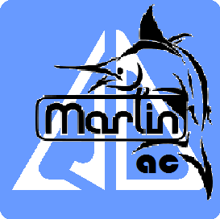

# Marlin 3D Printer Firmware

## Marlin 1.1-AC

This is the developers branch for Marlin-AC, always ahead of official Marlin. Some features will only be available in Marlin-AC.

## Stable Release Branch

This branch contains the final version of Marlin (1.1.9 – 31 july 2018) with all the additional AC developments to date.

## Current Status: Closed

G-force9-AC
- merge update to final Marlin 1.1.9
- including fix for the infamous M851 bug

G-force8a-AC
- update to pull requests
- M212
- S(etup) parameter

G-force8-AC
- more functions
- LCD z_offset for no-probe deltas and all printers

Xmas-AC
- merge update to Marlin 1.1.8
- include G-force
- destructive Xmas bug fixed

1.1.7-AC
- merge update to Marlin 1.1.7
- include G-force
- z_offset shift Zx.xx

G-force7-AC
- revert kinematic iterations
- z_offset calibration P-1

G-force6-AC
- new convergence matrices
- new auto tune
- new raw calibration
- calibration reference
- kinematic iterations
- updated documentation

1.1.6f-AC
- (abandonned)

1.1.6e-AC
- probe error handling
- verbose level (0-3)
- raw calibration

1.1.6d-AC
- delta_height variable
- update to bugfix1.1.x G33 changes

1.1.6c-AC
- Marlin 1.1.5 bugs fixed

1.1.6b-AC
- universal number of calibration points
- new probe grids

1.1.6a-AC
- prepare for 2.0.0 release

1.1.6-AC
- merge update to Marlin 1.1.6

1.1.5d-AC
- A parameter : auto tune calibration factors

1.1.5c-AC
- documentation added
- new matrices
- move code to functions

1.1.5b-AC
- (abandoned)

1.1.5a-AC
- simplified matrix names
- new angle least squares normalization
- no normalizing on end-stops M666 and tower angles M665
- P0 normalize only (no probing)

1.1.5-AC
- merge update to Marlin 1.1.5

1.1.4-AC
- merge update to Marlin 1.1.4
- LCD fixes for manual probing

1.1.3d-AC
- calibration with manual probing

1.1.3c-AC
- alternative eccentric probe is_reachable fix

1.1.3b-AC
- some minor cleanup
- re-arrange delta configs
- eccentric probe is_reachable test

1.1.3a-AC
- F parameter

1.1.3-AC
- merge update to Marlin 1.1.3
- LCD menu fix

1.1.2-AC
- merge update to Marlin 1.1.2
- E parameter
- cleanup code

1.1.1b-AC
- eccentric probe fix
- don't stow after each probe
- deploy/stow fix

1.1.1a-AC
- test if outer radius is reachable
- C-parameter : calibration precision
- various small improvements

1.1.1-AC
- first probe to set height and prevent scraping of the bed
- completed naming and renamed tests to more comprehensive names
- merge update to Marlin 1.1.1

1.1.0b-AC
- prevent premature end of the iterations

1.1.0a-AC
- A and O parameters made obsolete
- quick homing with homing_delta()

1.1.0-AC
- update bugfixes from Marlin-1.1.0-1

## Marlin-AC Resources

- [Marlin Home Page](http://marlinfw.org/docs/gcode/G033.html) - The (one step behind) Marlin G33 Documentation.
- [RepRap.org Wiki Page](http://reprap.org/wiki/G-code#G33:_Delta_Auto_Calibration_.28Marlin_1.1.x.29) - G33 in (up to date) Marlin-AC.
- [Marlin-AC Forum](http://forums.reprap.org/read.php?178,762487) - discussions on Marlin-AC.
- [Marlin-AC FB](https://www.facebook.com/groups/FLSUN3DP/) the origins of Marlin-AC in the Flsun FB group

## Credits

The current Marlin-AC dev team consists of:
 - Luc Van Daele [[@LVD-AC](https://github.com/LVD-AC)] Dutch, French, English

only at the moment
